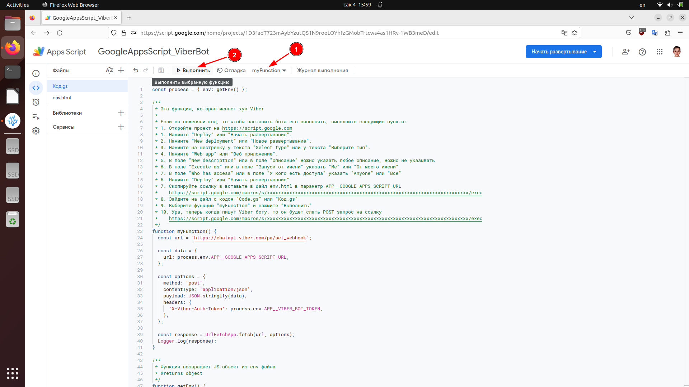

## Введение

Создадим Viber бота.

Бот будет работать без NodeJS.

Когда боту будет приходить сообщение,
то бот будет отправлять POST запрос на Google Apps Script.
Мы этот POST запрос будет обрабатывать и отвечать пользователю.

Дальше уже дело творческое:
- создал команду `/help`, по которой бот выведет список команд
- создал команду `/sendPhone`, по которой бот отправит клавиатуру для отправки телефона
- создал команду `/setName Джон`, по которой бот будет знать имя
    - Viber имя можно получить от ответа `response.sender.name`
    - но если пользователь запретил в настройках, то там будет имя 'Subscriber'
    - пользователя нужно просить включить:
    - Настройки > Конфиденциальность > Личные данные > Персонализация контента
    - чтобы не просить править настройки, я создал команду `/setName Чарли`

Плюсы Google Apps Script при создании Viber бота:
- это бесплатно
- не нужно иметь машину с утановленой NodeJS

Минусы Google Apps Script при создании Viber бота:
- нельзя использовать npm пакеты (нужно писать код самому)
- когда редактируешь код то, чтобы заставить бота выполнять новый код,
    нужно получать новую ссылку Google Apps Script
    и вешать хуком эту ссылку на Viber бота
    (как это делать я описал ниже)

## Создать бота Viber

1. Открываем https://partners.viber.com
1. Create Bot Account
    - Account Image: выбираем картинку
    - Account Name: `TestViberApi`
    - Uri: `TestViberApi20230219`
    - Category: Organizations & Institutions
    - Subcategory: University & College
    - Language: Russian
    - Account Description: `Test Viber API`
    - Website Address:
    - Email Adderss: `po000406@g.bstu.by`
    - Location: выбираем на карте универ БрГТУ
1. Копируем токен: `xxxxxxxxxxxxxxxx-xxxxxxxxxxxxxxxx-xxxxxxxxxxxxxxxx`

## Как загрузить этот код на Google Apps Script

Создаем проект:
1. Заходим на [Google Apps Scripts](https://script.google.com/home).
1. Жмем `New project` (Создать проект).
1. Переименовываю проект:
    - Жму `Untitled project` (Проект без названия).
    - Пишу `GoogleAppsScript_ViberBot`.
1. В файл `Code.gs` или в файл `Код.gs` пишем код [src/Code.gs](src/Code.gs).
1. Создаем файл секретов:
    1. Жму `+`.
    1. Жму `HTML`.
    1. Ввожу название `env`.
    1. Вставляю в файл `env.html` код [src/env.html](src/env.html).
    1. В env файле (`env.html`) нужно поменять следующие параметры:
        - `APP__VIBER_BOT_TOKEN` - токен бота viber (можно создать через сайт https://partners.viber.com)
        - `APP__GOOGLE_SHEETS_ID` - ид [Google Таблицы](https://docs.google.com/spreadsheets)
            ```
            https://docs.google.com/spreadsheets/d/<тут_ид_гугл_таблицы>/edit
            ```
            В Google таблице создай следующие листы:
            - `POST_err` - логи функции doPost, если возникло исключение
                - поле A (date) - хранит дату
                - поле B (userId) - хранит id viber пользователя
                - поле С (data) - хранит данные, которые пришли в POST запросе на Google Apps Script
            - `POST_logs` - логи функции doPost
                - поле A (date) - хранит дату
                - поле B (userId) - хранит id viber пользователя
                - поле С (data) - хранит данные, которые пришли в POST запросе на Google Apps Script
            - `GET_logs` - логи функции doGet
                - поле A (date) - хранит дату
                - поле B (data) - хранит тело запроса, которое отправлено на Viber API
            - `function_logs_sendMessage` - логи функции sendMessage
                - поле A (date) - хранит дату
                - поле B (data) - хранит тело запроса, которое отправлено на Viber API
            - `event_message` - таблица, которая хранит сообщения, которые отправил пользователь
                - поле A (date) - хранит дату
                - поле B (userId) - хранит id viber пользователя
                - поле С (languge) - хранит язык устройства
                - поле D (country) - хранит страну
                - поле E (text) - хранит сообщение, которое отправил viber пользователь
                - поле F (phoneNumber) - хранит номер телефона
                - поле G (pictureFileName) - храни имя картинки
                - поле H (pictureSize) - хранит размер картинки
                - поле I (pictureMedia) - хранит ссылку на картинку
            - `event_conversation_started` - таблица, которая показывает, что пользователь присоединился к боту
                - поле A (date) - хранит дату
                - поле B (userId) - хранит id viber пользователя
                - поле С (data) - хранит данные, которые пришли в POST запросе на Google Apps Script
            - `event_seen` - таблица, которая показывает, что сообщение прочитано
                - поле A (date) - хранит дату
                - поле B (userId) - хранит id viber пользователя
                - поле С (data) - хранит данные, которые пришли в POST запросе на Google Apps Script
            - `event_delivered`
                - поле A (date) - хранит дату
                - поле B (userId) - хранит id viber пользователя
                - поле С (data) - хранит данные, которые пришли в POST запросе на Google Apps Script
            - `event_unsubscribed` - таблица, которая показывает данные, отписавщихся
                - поле A (date) - хранит дату
                - поле B (userId) - хранит id viber пользователя
                - поле С (data) - хранит данные, которые пришли в POST запросе на Google Apps Script
            - `event_webhook` - таблица, которая показывает, что установлен новый хук
                - поле A (date) - хранит дату
                - поле B (data) - хранит данные, которые пришли в POST запросе на Google Apps Script
            - `event_failed`
        - `APP__GOOGLE_APPS_SCRIPT_URL` - ссылка на проект Google Apps Script
            Как получить ссылку на проект:
            1. Откройте проект на https://script.google.com
            1. 
                - Нажмите "Deploy" или "Начать развертывание".
                - Нажмите "New deployment" или "Новое развертывание".
                
            1. 
                - Нажмите на шестренку у текста "Select type" или у текста "Выберите тип".
                - Нажмите "Web app" или "Веб-приложение".
                
            1. 
                - В поле "New description" или в поле "Описание" можно указать любое описание, можно не указывать
                - В поле "Execute as" или в поле "Запуск от имени" указать "Me" или "От моего имени"
                - В поле "Who has access" или в поле "У кого есть доступа" указать "Anyone" или "Все"
                - Нажмите "Deploy" или "Начать развертывание"
                
            1. Скопируйте ссылку и вставьте в файл env.html в параметр APP__GOOGLE_APPS_SCRIPT_URL
                ```conf
                APP__VIBER_BOT_TOKEN=xxxxxxxxxxxxxxxx-xxxxxxxxxxxxxxxx-xxxxxxxxxxxxxxxx
                APP__GOOGLE_SHEETS_ID=xxxxxxxxxxxxxxxxxxxxxxxxxxxxxxxxxxxxxxxxxxxx
                APP__GOOGLE_APPS_SCRIPT_URL=https://script.google.com/macros/s/xxxxxxxxxxxxxxxxxxxxxxxxxxxxxxxxxxxxxxxxxxxxxxxxxxxxxxxxxxxxxxxxxxxxxxxx/exec
                ```
                
                

                
            1. 
                - Зайдите на файл с кодом "Code.gs" или "Код.gs"
                - Выберите функцию "myFunction" и нажмите "Выполнить"
                
            1. Ура, теперь когда пишут Viber боту, то он будет слать POST запрос на ссылку
                ```
                https://script.google.com/macros/s/xxxxxxxxxxxxxxxxxxxxxxxxxxxxxxxxxxxxxxxxxxxxxxxxxxxxxxxxxxxxxxxxxxxxxxxx/exec
                ```

## Структура проекта

```bash
sudo apt update
sudo apt install tree
tree --charset ascii -a -I ".git"
```

```
.
|-- assets              # папка с картинками для файла README.md
|   `-- *
|-- LICENSE             # лицензия репозитория
|-- .prettierignore     # на какие файлы не работает выравнивание кода
|-- .prettierrc.json    # выравнивание кода расширением Prettier в VS Code
|-- README.md           # инструкция репозитория
`-- src                 # папка с кодом
    |-- Code.gs         # файл скрипта в Google Apps Script
    `-- env.html        # файл с секретами (аналог .env)

2 directories
```

## Список использованных источников:
1. Мои проекты - Скрипт приложений Google Apps
    [Электронный ресурс] -
    Режим доступа:
    https://script.google.com/home.
    Дата доступа:
    14.02.2023.
1. Download Postman | Get Started for Free
    [Electronic resource] -
    Mode of access:
    https://www.postman.com/downloads.
    Date of access:
    14.02.2023.
1. web app — Блог Дмитрия Жука о работе c Google sheets, docs, apps script
    [Электронный ресурс] -
    Режим доступа:
    [https://dmitriizhuk.ru/2021/08/16/разбираемся-с-doget-в-скриптах-часть-1](https://dmitriizhuk.ru/2021/08/16/%D1%80%D0%B0%D0%B7%D0%B1%D0%B8%D1%80%D0%B0%D0%B5%D0%BC%D1%81%D1%8F-%D1%81-doget-%D0%B2-%D1%81%D0%BA%D1%80%D0%B8%D0%BF%D1%82%D0%B0%D1%85-%D1%87%D0%B0%D1%81%D1%82%D1%8C-1).
    Дата доступа:
    19.02.2023.
1. How do I append a blank row in a Google Spreadsheet with Apps Script? - Stack Overflow
    [Electronic resource] -
    Mode of access:
    https://stackoverflow.com/questions/34689556/how-do-i-append-a-blank-row-in-a-google-spreadsheet-with-apps-script.
    Date of access:
    19.02.2023.
1. ЧАТ БОТ VIBER НА PHP #1 - YouTube
    [Электронный ресурс] -
    Режим доступа:
    https://www.youtube.com/watch?v=ATF7tN69xoQ.
    Дата доступа:
    19.02.2023.
1. ЧАТ БОТ VIBER НА PHP #1 - YouTube
    [Электронный ресурс] -
    Режим доступа:
    https://www.youtube.com/watch?v=ATF7tN69xoQ.
    Дата доступа:
    19.02.2023.
1. Viber REST API | Viber Developers Hub
    [Electronic resource] -
    Mode of access:
    https://developers.viber.com/docs/api/rest-bot-api.
    Date of access:
    19.02.2023.
